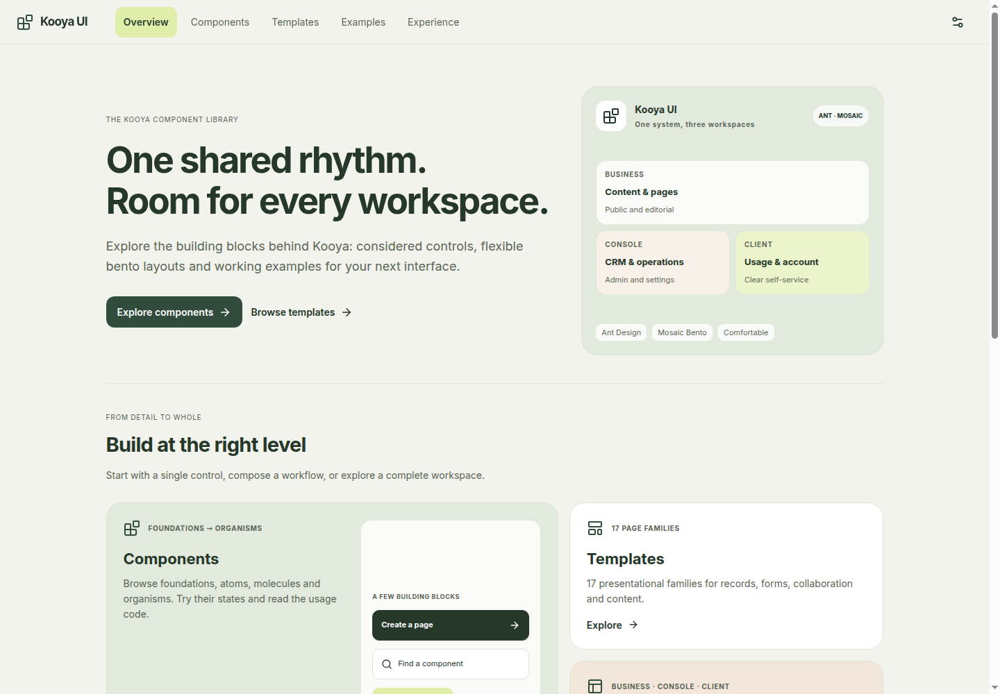
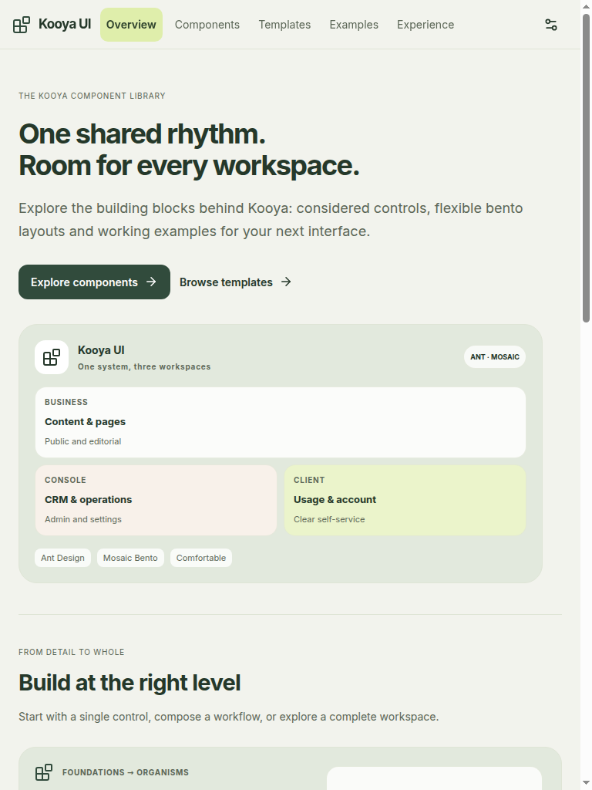
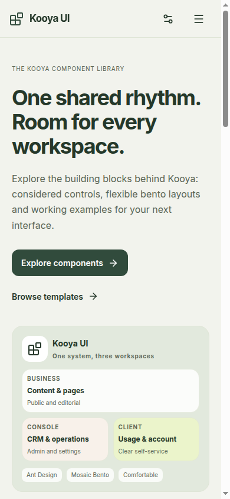

# Kooya UI

Kooya UI is an open-source React component and template library built on Ant
Design. It uses atomic design and supports multiple visual themes and page
compositions for business, administration, CMS, and client experiences.

- **Default style:** Mosaic Bento, comfortable density
- **Themes:** Mosaic, Kooya Signature, Canvas, Client, and consumer-defined themes
- **Compositions:** Mosaic, Orbit, Canvas, Flow
- **Runtime:** React 18.3 or 19 with Ant Design 6.6.5
- **License:** MIT; retain the copyright and license notice when redistributing

## Preview

| Desktop                                                                      | Tablet                                                                     | Phone                                                                       |
| ---------------------------------------------------------------------------- | -------------------------------------------------------------------------- | --------------------------------------------------------------------------- |
|  |  |  |

## Try the library

Requirements: Node.js 22 or newer and Corepack.

```sh
corepack pnpm install --frozen-lockfile
corepack pnpm --filter @kooyaph/ui build
corepack pnpm --filter @kooyaph/ui-playground dev
```

The playground uses fictional records and in-memory interactions. Storybook
shows the atomic catalog, templates, states, and accessibility guidance.

## Import components and themes

Components are exported by atomic family. Import only the named components your
screen uses, and import a theme by its dedicated package path:

```tsx
import { Button } from "@kooyaph/ui/atoms";
import { TextField } from "@kooyaph/ui/molecules";
import { DataTable } from "@kooyaph/ui/organisms";
import { KooyaProvider } from "@kooyaph/ui";
import { signatureTheme } from "@kooyaph/ui/themes/signature";
import "@kooyaph/ui/styles.css";

export function App() {
  return (
    <KooyaProvider theme={signatureTheme} composition="mosaic">
      <TextField label="Workspace name" />
      <Button variant="primary">Save</Button>
    </KooyaProvider>
  );
}
```

`KooyaProvider` accepts a bundled palette, a registered theme name, or a
project-defined `KooyaTheme` object. See [theme creation](docs/themes.md) and
[component imports](docs/components.md).

The `0.3.0` distributable is attached to the public
[GitHub release](https://github.com/KooyaPH/kooya-ui/releases/tag/v0.3.0). Install
it directly from the release asset alongside React and Ant Design:

```sh
npm install https://github.com/KooyaPH/kooya-ui/releases/download/v0.3.0/kooyaph-ui-0.3.0.tgz antd@6.6.5
```

To build from source instead, the package lives in `packages/ui`:

```sh
corepack pnpm --filter @kooyaph/ui build
(cd packages/ui && npm pack --pack-destination /tmp)
```

The public archive includes its MIT license and third-party notices. The
consumer imports its chosen atomic entry points and theme subpaths as shown
above. The separate GitHub Packages registry remains restricted and requires
authentication; public installs use the release asset.

## Repository layout

```text
packages/ui/       Reusable foundations, atoms, molecules, organisms, templates
apps/playground/   Fictional interactive gallery
apps/storybook/    Component and template documentation

docs/              Design, API, accessibility, integration, and release guides
```

The component package contains no product APIs, authentication, permissions,
customer data, or persistence. Applications own those concerns and provide
records, callbacks, routing, and data-fetching behavior to the library.

## Documentation

- [Architecture](docs/architecture.md)
- [Themes and compositions](docs/themes.md)
- [Component APIs, states, and imports](docs/components.md)
- [Templates](docs/templates.md)
- [Design tokens and geometry](docs/design-system.md)
- [Loading, errors, caching, and keyboard patterns](docs/experience.md)
- [UI and accessibility manual](docs/ui-ux.md)
- [Branding](docs/branding.md)
- [Setup](docs/setup.md) and [contribution guide](CONTRIBUTING.md)
- [Release process](docs/release.md) and [upgrade guide](docs/upgrade.md)
- [Roadmap](docs/roadmap.md)

## Attribution and license

Kooya UI is available under the [MIT License](LICENSE). Keep its copyright and
license notice in copies or substantial portions of the software. See
[third-party notices](THIRD_PARTY_NOTICES.md) for dependency and preview asset
licensing.
